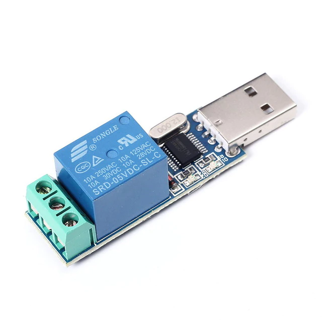

# usb-powered-relay
for LCUS-1 5V USB Relay Module CH340 USB Control Switch **in LINUX**

## HowTo

	Usage: ./usbser2relay.sh <path_to_tty_device> <0|1>
		   0: Turn the Relay ON
		   1: Turn the Relay OF

**note**: you should run the script with root permission!

Example:

	# ./usbser2relay.sh /dev/ttyUSB1 0